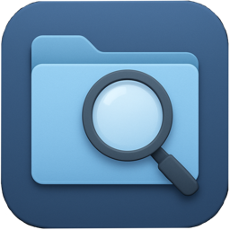
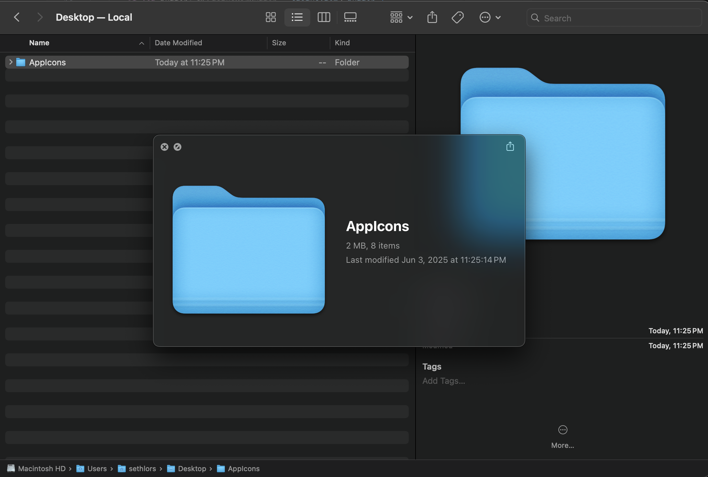
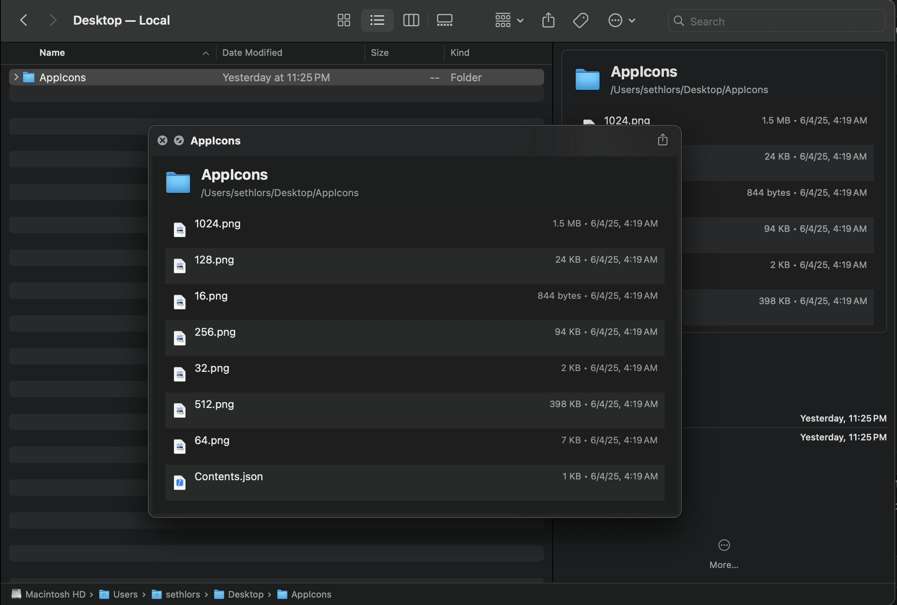

# QuickScope

QuickScope is a macOS app that extends Quick Look functionality to folders. When you press the spacebar on a folder in Finder, instead of just seeing the folder icon, you'll get a preview showing the folder's contents - just like how Quick Look works for files.

### With QuickScope, folder previews look like this:

### And with QuickScope installed, they look like this:

## How It Works

QuickScope consists of two components:

1. **Main App** (`QuickScope.app`): A minimal macOS application that hosts the Quick Look extension
2. **Quick Look Extension** (`QuickScopeQL.appex`): The extension that generates folder previews

When you install and run the app, it registers a Quick Look extension with the system. This extension handles the `public.folder` content type, allowing macOS to use QuickScope for folder previews.

## Installation

### Download the DMG file
[QuickScope.dmg](https://github.com/sethlors/QuickScope/raw/refs/heads/main/QuickScope-1.0.dmg)

1. Download the DMG file from the link above
2. Open the DMG file
3. Drag the `QuickScope.app` to your Applications folder
4. Launch the app by double-clicking `QuickScope.app` in your Applications folder
5. The app will run in the menu bar

### From Source

1. Clone this repository
2. Open `QuickScope.xcodeproj` in Xcode
3. Build and run the project (⌘+R)
4. The app will launch and install the Quick Look extension

## Usage

1. **Install the app**: Build and run QuickScope once to register the extension
2. **Use Quick Look**: In Finder, select any folder and press the spacebar
3. **Enjoy previews**: You'll see a detailed view of the folder's contents

### What You'll See

The folder preview includes:
- **Header**: Folder icon, name, and full path
- **File List**: All files and subfolders with their icons
- **File Details**: File sizes, modification dates, and types
- **Summary**: Total number of items in the folder

### Architecture

- **Language**: Swift 5.0
- **Framework**: Cocoa, QuickLook
- **Target**: macOS 14.5+
- **Extension Type**: Quick Look Preview Extension

## License

This project is open source. See the LICENSE file for details.
